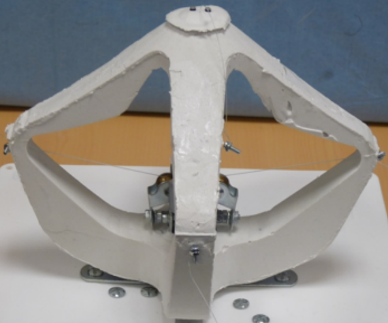
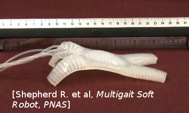
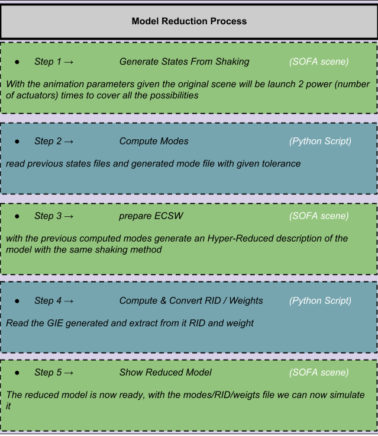

# Model Order Reduction Example


## Introduction <a name="introduction"></a>
***

In this python notebook exemple we will see with 2 real examples how to reduce a model from one of your sofa scene thanks to the **Model Order Reduction** plugin done by the INRIA research team **Defrost**.

the two examples will be :

- **[The Diamond](../examples/Diamond/diamond.html#diamond)** 



- **[The Starfish](../examples/Diamond/diamond.html#diamond)**



After these expample presentation we can now proceed to the reduction.
First we have to prepare it by setting a bunch of parameters while explaining there purpose (here the parameters will be set twice, one for the diamond and one for the starfish so you will be able to switch easily between each example) 

## User Paramters <a name="User Paramters"></a> 
***

here some import that will be usefull for this python notebook


```python
# Import
import os
import sys

sys.path.append(os.getcwd()+'/../python') # TO CHANGE

from plotly.offline import init_notebook_mode, iplot
import plotly.graph_objs as go
init_notebook_mode(connected=True)

# MOR IMPORT
import mor.script.morUtilityFunctions as ui
from mor.script import ReduceModel
from mor.script import ObjToAnimate
```

### The first important things to set are the different path where we will work: <a name="Important Path"></a> 
 - The scene you want to work on
 - The folder containing its mesh
 - The folder where you want the results to be put in


```python
# Important path
originalScene = ui.openFileName('Select the SOFA scene you want to reduce')
meshDir = ui.openDirName('Select the directory containing the mesh of your scene')
outputDir = ui.openDirName('Select the directory tha will contain all the results')
```

### Now The different parameters for the reduction <a name="Reduction Parameters"></a>

#### nodesToReduce <a name="nodesToReduce"></a>
- *ie : list containing the model path you want to reduce.

For example if you want to reduce child2 which is in the sofa graph scene a child of child1 which is a child of root you would give this path : **'/child1/child2'** * 


```python
nodesToReduce_DIAMOND = ['/modelNode']
nodesToReduce_STARFISH =[('/model','/model/modelSubTopo')]
```

#### listObjToAnimate <a name="listObjToAnimate"></a>
   
- *ie : contain a list of object from the class ObjToAnimate.
        
A ObjToAnimate will define an object to "animate" during the shaking, this animation is the variation of a particular value of this object with a certain increment on a with a minumum/maximum value to attain. There are 3 important parameter to this object :
- location : sofa node name in which we will work
- animFct : the animation function we will use (by default defaultShaking)
- objName : the object name we want to animate (by default None)
        
For exemple here we want to animate the node named "nord", but we won't specify either the animFct and objName so the default animation function will be used and be apply on the first default object it will find. The default function will need 2 additionnal parameters :
- increment
    - *ie : By which value we increment for each animation during one step* 
- maxPull
    - *ie : The maximum value of each animation* 
            
nord = ObjToAnimate("nord", incr=5,incrPeriod=10,rangeOfAction=40)


```python
# animation parameters

### DIAMOND ROBOT PARAM
nord = ObjToAnimate("nord", incr=5,incrPeriod=10,rangeOfAction=40)
sud = ObjToAnimate("sud",incr=5,incrPeriod=10,rangeOfAction=40)
est = ObjToAnimate("est",incr=5,incrPeriod=10,rangeOfAction=40)
ouest = ObjToAnimate("ouest",incr=5,incrPeriod=10,rangeOfAction=40)
listObjToAnimate_DIAMOND = [nord,ouest,sud,est]


### STARFISH ROBOT PARAM
centerCavity = ObjToAnimate("centerCavity",incr=350,incrPeriod=2,rangeOfAction=3500)
rearLeftCavity = ObjToAnimate("rearLeftCavity",incr=200,incrPeriod=2,rangeOfAction=2000)
rearRightCavity = ObjToAnimate("rearRightCavity",incr=200,incrPeriod=2,rangeOfAction=2000)
frontLeftCavity = ObjToAnimate("frontLeftCavity",incr=200,incrPeriod=2,rangeOfAction=2000)
frontRightCavity = ObjToAnimate("frontRightCavity",incr=200,incrPeriod=2,rangeOfAction=2000)
listObjToAnimate_STARFISH = [centerCavity,rearLeftCavity,rearRightCavity,frontLeftCavity,frontRightCavity]
```

#### Modes parameters <a name="Modes parameters"></a>

- addRigidBodyModes 
- tolModes
    - *ie : With which tolerance we want to select our modes (add explanation of the selection process)* 


```python
addRigidBodyModes_DIAMOND = [0,0,0]
addRigidBodyModes_STARFISH = [1,1,1]

tolModes = 0.001
```

- tolGIE
    - *ie : blabla ...* 


```python
# Tolerance
tolGIE =  0.05
```

### And to finish some optionnal parameters <a name="Optionnal Parameters"></a>


```python
# Optionnal
verbose = False

packageName = 'test'
addToLib = False
```

We can now execute one of the reduction we choose with all these parameters

## Execution <a name="Execution"></a>
***


### Initialization <a name="Initialization"></a>
The execution is done with an object from the class ReduceModel.
we initialize it with all the previous argument either for the Diamond or Starfish example


```python
# Initialization of our script
nodesToReduce = nodesToReduce_DIAMOND # nodesToReduce_STARFISH
listObjToAnimate = listObjToAnimate_DIAMOND # listObjToAnimate_STARFISH
addRigidBodyModes = addRigidBodyModes_DIAMOND # addRigidBodyModes_STARFISH

reduceMyModel = ReduceModel(    originalScene,  
                                nodesToReduce,
                                listObjToAnimate,
                                tolModes,tolGIE,
                                outputDir,
                                meshDir,
                                packageName = packageName,
                                addToLib = addToLib,
                                verbose = verbose,
                                addRigidBodyModes = addRigidBodyModes)
```

We can finally perform the actual reduction. here is a schematic to resume the differents steps we will perform : 



### Phase 1 <a name="Phase 1"></a>

We modify the original scene to do the first step of MOR :   
- We add animation to each actuators we want for our model 
- And add a writeState componant to save the shaking resulting states  


```python
reduceMyModel.phase1()
```

### Phase 2 <a name="Phase 2"></a>

With the previous result we combine all the generated state files into one to be able to extract from it the different mode


```python
reduceMyModel.phase2()
```


```python
# Plot result
with open(reduceMyModel.packageBuilder.debugDir+'Sdata.txt') as f:
    content = f.readlines()
    
content = [x.strip() for x in content]

data = [go.Bar(x=range(1, len(content)+1),
            y=content)]

iplot(data, filename='jupyter/basic_bar')
```


```python
print("Maximum number of Modes : ")
reduceMyModel.reductionParam.nbrOfModes
```

### Phase 3 <a name="Phase 3"></a>

We launch again a set of sofa scene with the sofa launcher with the same previous arguments but with a different scene

This scene take the previous one and add the model order reduction component:
- HyperReducedFEMForceField
- MappedMatrixForceFieldAndMass
- ModelOrderReductionMapping and produce an Hyper Reduced description of the model


```python
reduceMyModel.phase3()
```

### Phase 4 <a name="Phase 4"></a>

Final step : we gather again all the results of the previous scenes into one and then compute the RID and Weigts with it. Additionnally we also compute the Active Nodes


```python
reducedScene = reduceMyModel.phase4()
```

End of example you can now go test the results in the folder you have designed at the beginning of this tutorial

## To go Further <a name="To go Further"></a>
***

Here are some link to additionnal information about the plugin and a more detailed description of its operation

**link to Olivier paper**

**link to website doc**


